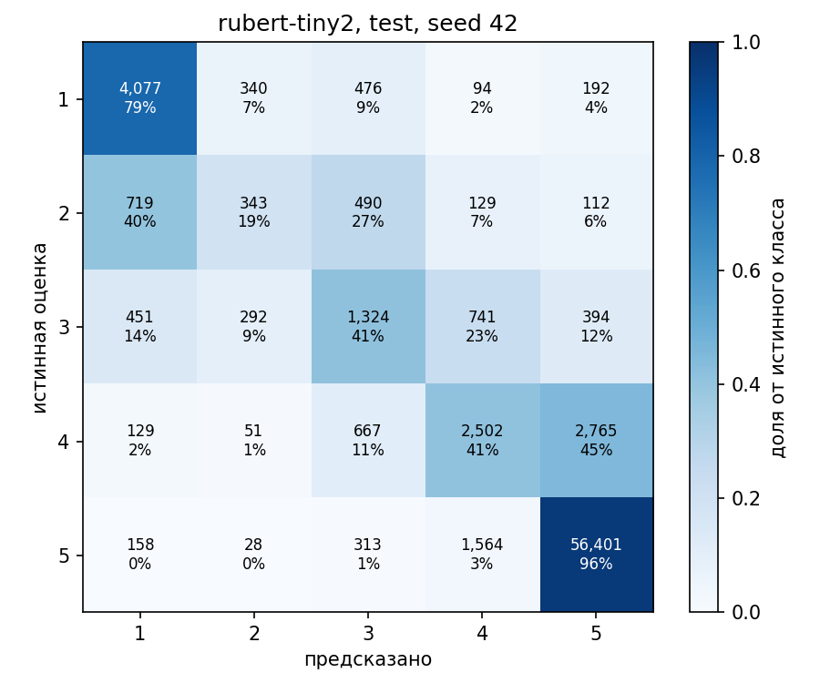
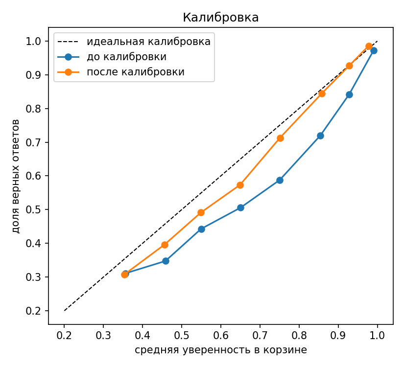

<div align="center">

# sentiment-reviews

**Оценка 1–5 по тексту русскоязычного отзыва: от аудита данных до REST API в Docker**


</div>

Классификация рейтинга (1–5 звёзд) по отзывам на организации. Датасет: [Яндекс Geo Reviews 2023](https://github.com/yandex/geo-reviews-dataset-2023), 500 000 отзывов. Проект построен как воспроизводимый эксперимент: аудит данных, split без утечек, честный бейзлайн, дообучение трансформера, разбор ошибок, калибровка вероятностей и сервис.

## Результаты (test)

| Модель | Macro-F1 | MAE | Accuracy | Размер | Задержка, CPU |
|---|---|---|---|---|---|
| Константа «всегда 5» | 0.176 | 0.517 | 0.782 | — | — |
| TF-IDF + LogReg | 0.515 | 0.271 | 0.806 | 36 МБ | 13.3 мс |
| **rubert-tiny2** (3 seed'а) | **0.560 ± 0.004** | **0.183 ± 0.001** | **0.865** | 119 МБ | 5.4 мс |

Задержка: один запрос, p50, 24 потока CPU. Классы сильно несбалансированы (78% пятёрок), поэтому главная метрика macro-F1, а не accuracy: константа «всегда 5» даёт accuracy 0.78 при macro-F1 0.18.

> Модели обучались в разных условиях (351k против 100k отзывов, веса классов, GPU против CPU). При равных условиях (50k, `balanced`, val) разрыв меньше: macro-F1 0.527 против 0.509. Выигрыш трансформера реален (+0.048, 95% ИИ 0.041–0.055 на test), но скромнее, чем в таблице.

## Что внутри

- **Split без утечек.** Отзывы делятся по организации: 54% отзывов относятся к сетям с несколькими адресами, при случайном разбиении они попали бы и в train, и в test. Проверки на утечки (группы, точные и близкие дубликаты) пройдены.
- **Дисциплина с test.** Конфигурации выбирались только на val, test оценивался один раз на модель; последующие обращения к нему (проверки и подтверждения выводов) не влияли на выбор моделей и параметров.
- **Разбор ошибок.** Около 75% ошибок приходятся на соседний класс; слабые места: 2★ (recall около 0.19) и четвёрки, уходящие в пятёрки. Ансамбль из трёх seed'ов значимого выигрыша не даёт.
- **Калибровка.** Вероятности трансформера переуверены (ECE 0.048); температурное масштабирование, подобранное на val, снижает ECE до 0.018 на test и не меняет предсказаний.
- **Сервис.** FastAPI + Docker на CPU: p50 одиночного запроса 6–8 мс, ответы контейнера совпали с сохранёнными предсказаниями на 500 отзывах val (0 расхождений). Образ 1.95 ГБ на диске.

<table>
<tr>
<td align="center"><br><sub>Матрица ошибок rubert-tiny2 (test)</sub></td>
<td align="center"><br><sub>Калибровка до и после (test)</sub></td>
</tr>
</table>

## Быстрый старт

Веса моделей в репозиторий не входят. Для сервиса нужны `models/rubert-tiny2/seed_42` (получаются командой `python -m src.models.transformer --final`, лучше на GPU).

```bash
# сервис в Docker (CPU)
docker build -t sentiment-reviews .
docker run --rm -p 8000:8000 sentiment-reviews

# запрос (интерактивная документация: http://localhost:8000/docs)
curl -X POST http://localhost:8000/predict -H "Content-Type: application/json" \
     -d '{"text": "Отличное место, очень вежливый персонал"}'
```

Ответ: `rating` (1–5), откалиброванные `probabilities`, `confidence`, `expected_rating` и флаг `truncated` (отзыв обрезан по `max_length=256`). Пакетный режим: `POST /predict/batch` (до 64 текстов).

```bash
# окружение и тесты
python -m venv .venv && .venv\Scripts\activate          # Linux/macOS: source .venv/bin/activate
pip install torch --index-url https://download.pytorch.org/whl/cpu
pip install -r requirements.txt
pytest
```

Датасет нужно скачать вручную в `data/raw/`. Все команды по фазам (очистка, бейзлайн, обучение, анализ ошибок, калибровка, замеры сервиса): [docs/REPORT.md](docs/REPORT.md#воспроизведение).

## Ограничения

- Бейзлайн оценён одним запуском на test; число эпох трансформера не перебиралось.
- Выводы о срезах (длина, эмодзи, рубрики) описательные, причины не проверялись; эвристика «прямое упоминание оценки» не проверена вручную.
- Сервис проверен на одной машине, на CPU, без нагрузочного теста.
- Оценка относится к одному датасету (Яндекс Карты, январь–июль 2023).

## Подробности

- [Полный отчёт](docs/REPORT.md): данные, модели, learning curve, сравнение при равных условиях, все таблицы и замеры.
- [Разбор ошибок](reports/error_analysis.md), [аудит данных](reports/data_audit.md), [проверка утечек](reports/leakage_report.md).

## Структура

```
configs/      параметры (данные, бейзлайн, трансформер)
src/          data, models, evaluation, experiments, serving
tests/        pytest
reports/      аудит, таблицы, графики, журнал experiments.csv
docs/         полный отчёт
Dockerfile    образ сервиса
```

## Лицензия

Код: [MIT](LICENSE). Датасет: MIT, © 2023 YANDEX LLC ([лицензия](https://github.com/yandex/geo-reviews-dataset-2023/blob/master/LICENSE.md)).
